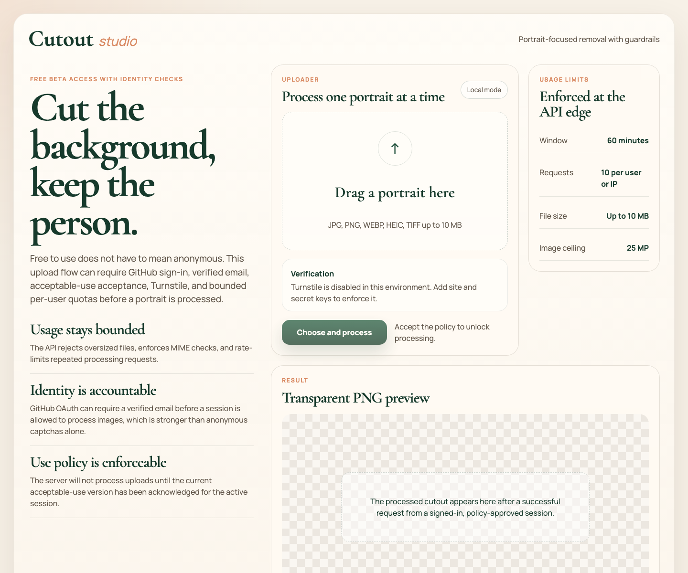
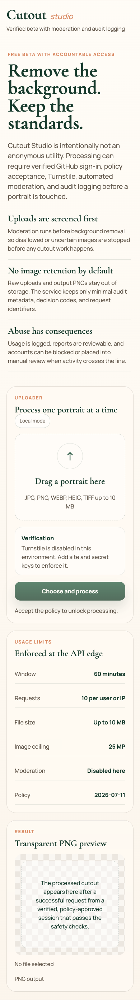

# Cutout Studio

Cutout Studio is a portrait-focused background removal app with a stricter beta launch posture than a typical anonymous image utility.

It ships with:

- a local CLI for single-image and directory batch processing
- a web product built with React, TypeScript, Express, and local ONNX-based person segmentation
- safety controls for verified GitHub sign-in, policy acceptance, moderation, audit logging, abuse reporting, and admin review

## Product overview





## Safety model

The intended beta flow is:

1. User signs in with GitHub.
2. The callback accepts only accounts with a verified GitHub email.
3. The app creates or updates the user record in Postgres.
4. The current acceptable-use version must be accepted.
5. Turnstile runs when configured.
6. Image moderation runs before background removal.
7. Only then does the cutout pipeline execute.

Failure is intentionally closed for safety-critical steps:

- no authenticated session
- blocked or review-required account
- stale or missing policy acceptance
- failed Turnstile challenge when enabled
- moderation provider failure when `MODERATION_FAIL_CLOSED=1`
- moderation decisions that are blocked or uncertain

The default privacy posture is no image retention:

- raw uploads are processed in memory only
- output PNGs are returned directly and not persisted
- audit logs store request identifiers, digests, status codes, and moderation decisions only

## Screens and controls

- `/api/session` exposes whether the user is signed in, whether the current policy is accepted, the user status, whether the session is admin-capable, and whether moderation is active.
- `/api/remove-background` enforces auth, CSRF verification, account state, policy acceptance, Turnstile, moderation, payload validation, and rate limiting.
- `/api/report-abuse` lets signed-in users submit abuse reports tied to a request ID.
- `/api/admin/review`, `/api/admin/users/:userId/status`, and `/api/admin/reports/:reportId/review` provide a minimal review surface for admins listed in `ADMIN_EMAILS`.
- `/api/health` reports process liveness.
- `/api/readiness` reports dependency readiness for Postgres and moderation.

## Runtime configuration

Copy [.env.example](/Users/tim/Documents/Codex/2026-07-11/building-a-background-removal-tool-you/.env.example:1) to `.env` and set the values required for your environment.

Core variables:

- `SITE_URL`: canonical public base URL used for auth callbacks and production links
- `DATABASE_URL`: managed Postgres connection string used for users, sessions, policy acceptance, audit events, abuse reports, and moderation decisions
- `DATABASE_SSL`: set to `1` when your Postgres host requires SSL
- `SESSION_SECRET`: cookie signing secret
- `ADMIN_EMAILS`: comma-separated admin allowlist
- `ACCEPTABLE_USE_VERSION`: policy version that must be accepted before processing
- `SEGMENTATION_MODEL`: local segmentation model size; this beta defaults to `small` to keep deployment payloads practical

GitHub auth:

- `GITHUB_CLIENT_ID`
- `GITHUB_CLIENT_SECRET`
- `GITHUB_CALLBACK_URL`

Human verification:

- `TURNSTILE_SITE_KEY`
- `TURNSTILE_SECRET_KEY`

Moderation:

- `MODERATION_PROVIDER`
- `MODERATION_MODEL`
- `MODERATION_FAIL_CLOSED`
- `OPENAI_API_KEY`

Current implementation notes:

- the moderation abstraction is provider-driven, but this repo currently implements `openai` and `disabled`
- the session store falls back to in-memory mode only when `DATABASE_URL` is absent; production beta deployment should always provide Postgres
- only the small local segmentation model is vendored; larger model variants should be added through a dedicated artifact path before enabling them

## Local development

Install dependencies:

```bash
npm install
```

Run the API and frontend together:

```bash
npm run dev
```

Build the product:

```bash
npm run build
```

Run a launch preflight against the current environment:

```bash
npm run deploy:preflight
```

Prepare or verify the managed Postgres schema:

```bash
npm run db:prepare
```

Serve the built client through the API:

```bash
npm run start
```

Run the test suite:

```bash
npm test
```

Security audit:

```bash
npm audit
```

GitHub Actions runs `npm ci`, `npm test`, `npm run build`, and `npm audit --audit-level=moderate`
on pushes to `main` and pull requests.

## CLI usage

Single image:

```bash
node ./src/cli.js image --input ./photos/person.jpg
```

Batch a directory:

```bash
node ./src/cli.js batch --input ./photos --output ./exports --recursive
```

Notes:

- output is always PNG because transparency is required
- the segmentation backend is tuned for person photos and may underperform on non-person images
- batch mode continues through failures so one bad file does not abort the whole directory run

## Data model

The production data store is keyed by `DATABASE_URL` and includes:

- `users`
- `policy_acceptances`
- `audit_events`
- `abuse_reports`
- `moderation_decisions`
- Postgres-backed session rows via `connect-pg-simple`

## Deployment

This repo is wired for Sites with [.openai/hosting.json](/Users/tim/Documents/Codex/2026-07-11/building-a-background-removal-tool-you/.openai/hosting.json:1).

Public deployment:

- Title: `Cutout Studio`
- URL: `https://cutout-studio.tim-o-finch.chatgpt.site`
- Slug: `cutout-studio`

Before a real public beta launch, set production environment variables for:

- GitHub OAuth
- managed Postgres
- moderation provider credentials
- Turnstile
- `SITE_URL` set to the final deployed URL

Without those values, the site can render but it will not satisfy the strict verified beta flow described above.

The Sites artifact is intentionally packaged with a dependency-free runtime shim. Until production
secrets are configured, it serves the app shell and fail-closed API responses rather than running
background removal without GitHub login, Postgres, moderation, and verification.

Recommended production launch sequence:

1. Set the required runtime variables in Sites.
2. Run `npm run deploy:preflight` locally against the same values.
3. Run `npm run db:prepare` against the managed Postgres database.
4. Verify `npm test`, `npm run build`, and `npm audit`.
5. Save and deploy the matching Sites version.
6. Confirm `/api/health` and `/api/readiness` are green on the live URL.
7. Update the portfolio launch post and project page with the public beta link.

## Tests added for this hardening pass

- config validation for durable auth requirements
- CSRF token checks for signed-in write requests
- anonymous, blocked, and stale-policy processing rejections
- moderation fail-closed behavior
- moderation block logging
- successful processing audit logging
- abuse report creation
- readiness degradation reporting
- database readiness without `DATABASE_URL`
- admin account review actions
